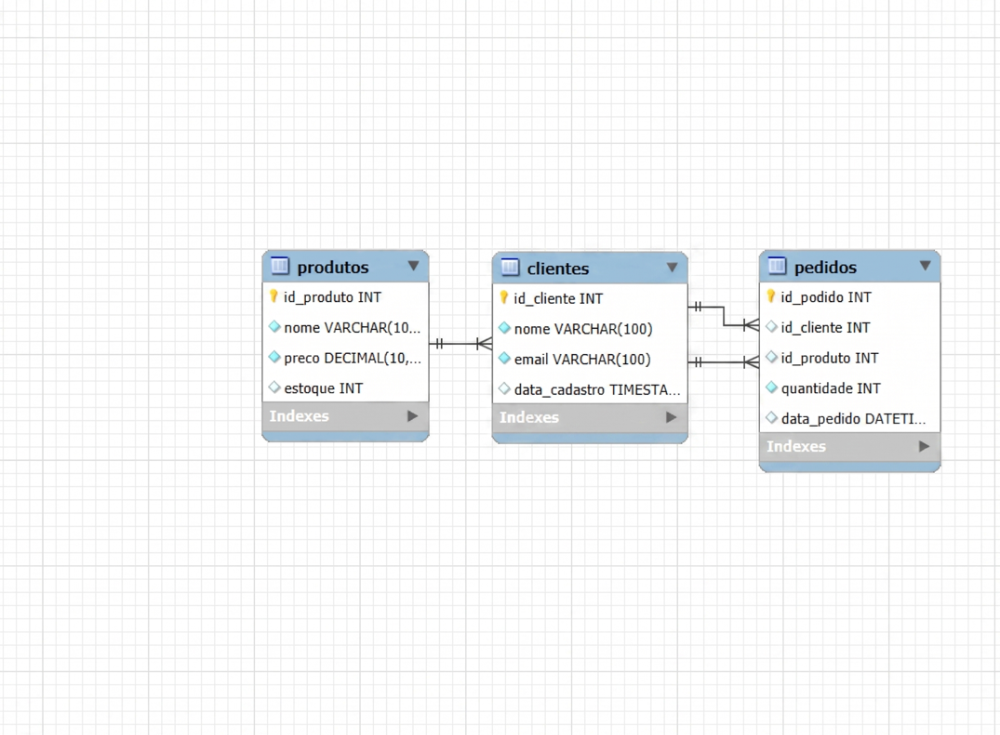

# Projeto E-commerce MySQL 🛒

Este é um projeto prático de banco de dados desenvolvido para os meus estudos de **Análise e Desenvolvimento de Sistemas (UNISA)**.

## 📌 O que este banco faz:
- Gerencia o cadastro de **Clientes**.
- Controla o estoque de **Produtos**.
- Registra os **Pedidos** e relaciona quem comprou o quê.

## 📊 Modelagem:

## 📁 Como usar:
1. Execute `01_schema.sql` para criar a estrutura.
2. Execute `02_dados.sql` para inserir dados de teste.
3. Use o `03_consultas.sql` para ver os relatórios de vendas.
